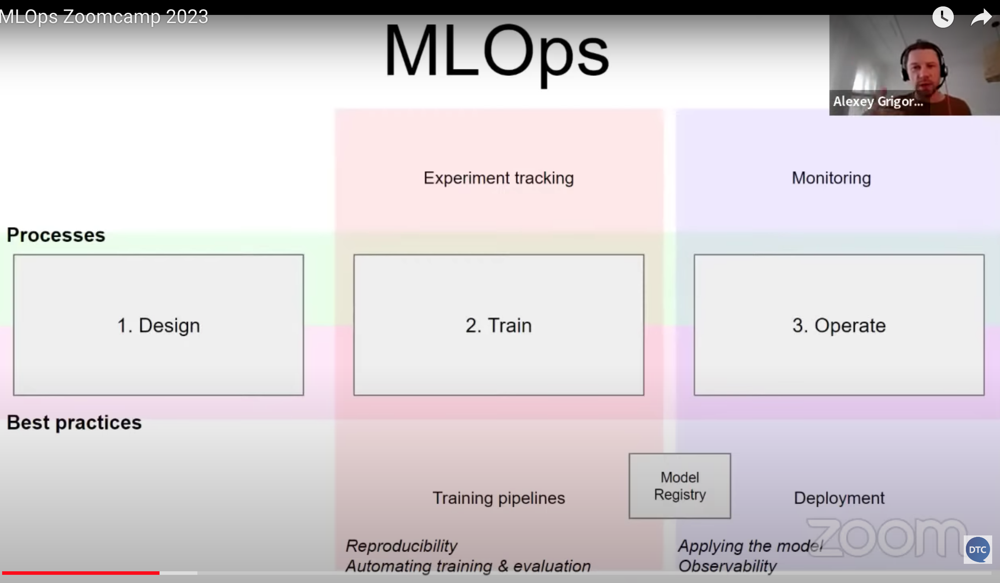

# Introduction

Source: https://github.com/DataTalksClub/mlops-zoomcamp/tree/main/01-intro


## 1.1 Introduction





## 1.2 Environment

Recommended development environment: **Linux**

### 1.2.1 Anaconda

```bash
wget https://repo.anaconda.com/archive/Anaconda3-2022.05-Linux-x86_64.sh
bash Anaconda3-2022.05-Linux-x86_64.sh
```

### 1.2.2 Update existing packages

```bash
sudo apt update
```

### 1.2.3 Install docker

```bash
sudo apt install docker.io
```

run docker with sudo

```bash
sudo groupadd docker
sudo usermod -aG docker $USER
```

### 1.2.4 Install docker compose

Install docker-compose in a separate directory

```bash
mkdir soft
cd soft
```

To get the latest release of Docker Compose, go to https://github.com/docker/compose and download the release for your OS.

```bash
wget https://github.com/docker/compose/releases/download/v2.5.0/docker-compose-linux-x86_64 -O docker-compose
```

Make it executable

```bash
chmod +x docker-compose
```

Add to the `soft` directory to `PATH`. Open the `.bashrc` file with `nano`:

```bash
nano ~/.bashrc
```

In `.bashrc`, add the following line:

```bash
export PATH="${HOME}/soft:${PATH}"
```

Save it and run the following to make sure the changes are applied:

```bash
source .bashrc
```

### 1.2.5 Run Docker

```bash
docker run hello-world
```

If you get `docker: Got permission denied while trying to connect to the Docker daemon socket at unix:///var/run/docker.sock: Post "http://%2Fvar%2Frun%2Fdocker.sock/v1.24/containers/create": dial unix /var/run/docker.sock: connect: permission denied.` error, restart your VM instance.

**Note**: If you get `It is required that your private key files are NOT accessible by others. This private key will be ignored.` error, you should change permits on the downloaded file to protect your private key:

```bash
chmod 400 name-of-your-private-key-file.pem
```

## 1.3 [Optional] Training a ride duration prediction model

- [Notebook](duration_prediction.ipynb)
